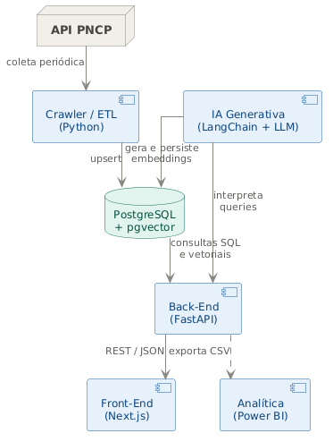
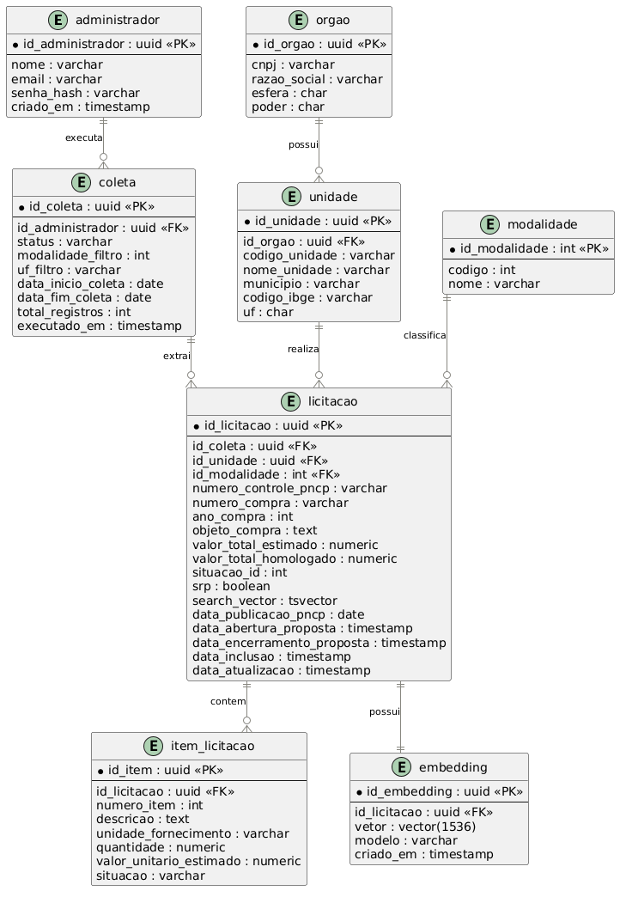
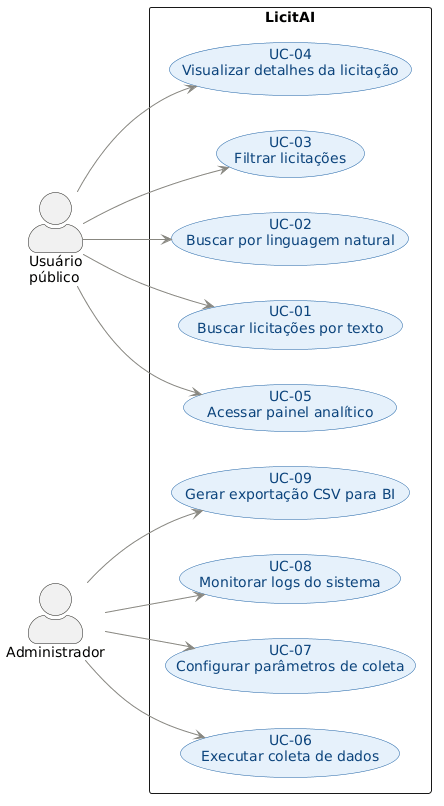

# LicitAI

Sistema de coleta, armazenamento e consulta de licitações públicas brasileiras a partir do **PNCP** (Portal Nacional de Contratações Públicas), com suporte a busca por texto completo, filtros avançados e embeddings vetoriais para busca semântica por IA.

---

## Arquitetura



O sistema é composto por cinco camadas principais:

| Camada | Tecnologia | Responsabilidade |
|---|---|---|
| **Crawler / ETL** | Python + `requests` | Coleta periódica via API pública do PNCP |
| **Banco de Dados** | PostgreSQL + pgvector | Armazenamento relacional e busca vetorial |
| **Back-End** | FastAPI | API REST para consultas SQL e vetoriais |
| **IA Generativa** | LangChain + LLM | Geração de embeddings e interpretação de queries em linguagem natural |
| **Front-End / BI** | Next.js + Power BI | Interface de busca e painel analítico |

---

## Modelo de Dados



As entidades centrais são:

- **`licitacao`** — registro de cada contratação pública, com `search_vector` (full-text search em português) e relacionamento 1-para-1 com `embedding` (vetor de 1536 dimensões).
- **`item_licitacao`** — itens individuais de cada licitação.
- **`orgao` / `unidade`** — hierarquia dos órgãos contratantes.
- **`modalidade`** — classificação da modalidade de contratação (Pregão, Dispensa, etc.).
- **`coleta`** — registro de cada execução do crawler, com status e metadados do intervalo coletado.

---

## Casos de Uso



- **Usuário público** — busca por texto, linguagem natural, filtros por UF/modalidade/período e painel analítico.
- **Administrador** — dispara coletas, configura parâmetros, monitora logs e exporta CSV para BI.

---

## Stack

- **Python 3.13**
- **FastAPI** + **Uvicorn** — API REST assíncrona
- **SQLAlchemy 2** — ORM e queries SQL
- **PostgreSQL** + **pgvector** — banco relacional com extensão de vetores
- **requests** — cliente HTTP para a API do PNCP
- **pytest** — testes automatizados

---

## Estrutura do Projeto

```
.
├── api/
│   ├── routes.py        # endpoints FastAPI
│   └── schemas.py       # modelos Pydantic de entrada/saída
├── crawler/
│   ├── client.py        # cliente HTTP para o PNCP (com retry/backoff)
│   └── etl.py           # pipeline de extração, transformação e carga
├── db/
│   ├── models.py        # modelos SQLAlchemy
│   └── session.py       # configuração da sessão de banco
├── tests/               # suite de testes (pytest)
├── cli.py               # interface de linha de comando para o crawler
├── requirements.txt
└── tees-docs/           # diagramas e documentação do projeto
```

---
